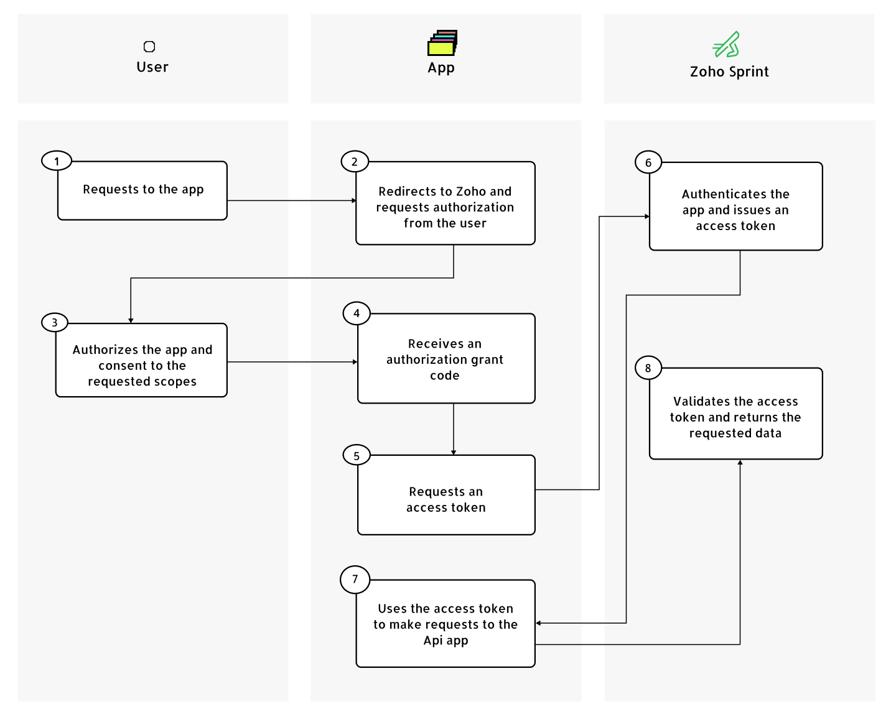

# OAuth overview

This guide introduces the OAuth flow for ZohoTimesheet app.

## Introduction to OAuth

OAuth 2.0 is the industry-standard protocol for authorizing or giving permissions to apps.
This differs from authentication, which is the process of verifying the identity of the user or the app.

## The OAuth flow

Zoho Sprint uses OAuth 2.0's [authorization code giant flow](https://datatracker.ietf.org/doc/html/rfc6749#section-4.1) to issue access tokens on behalf of users.
The OAuth flow is used so that user can authorize Zoho app to access data in Sprint.

The following diagram illustrates the OAuth flow based on the actions of the user, app, and Zoho Sprint:

1. Requests to the application
2. Redirects to Zoho and request authorization from the user request
3. Authorizes the application and show consent to the request scopes
4. Receives and authorization grant code
5. Requests an access token
6. Authenticates the application and issue an access token
7. Uses the access token to make requests to the Api
8. Validates the access token and returns the requested data